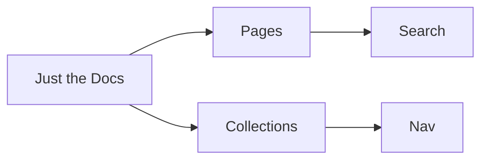

# Configuring Just the Docs (Jekyll)

This guide shows how to configure the Just the Docs theme for Jekyll using a single site configuration and clear code examples. It includes both gem-based and remote theme setups, plus navigation, search, analytics, and UI customizations.

## Quick start

Choose one of the two supported theme setups and create a minimal configuration file to get the site running. Local development uses Bundler, while GitHub Pages can use a remote theme or the template repository approach.

## Minimal _config.yml (gem-based)

Use this when the theme is installed as a Ruby gem.

```yaml
# _config.yml
title: Documentation
description: A documentation Page
theme: just-the-docs
logo: "/assets/images/example.png"

favicon_ico: "/assets/images/favicon.ico"
color_scheme: light

url: https://example.github.io
```

## Gemfile example

Add the theme (gem-based) or plugins needed for remote themes and local preview.

```ruby
# Gemfile
source "https://rubygems.org"

gem "jekyll", "~> 4.3"        # or as required by the environment
gem "jekyll-seo-tag"

```

## Local development

Install dependencies and run a development server.

```bash
bundle install
bundle exec jekyll serve
# Open http://127.0.0.1:4000 (or http://localhost:4000)
```

## Project structure

Organize content and assets as follows; collections must live in underscored directories (for example, _guides).

```
.
├── _config.yml
├── _includes/
│   └── (content)
├── assets/
│   ├── images/
│   │   └── (content)
│   └── css/
│       └── (content)
├── docs/
│   └── (content)
├── index.md
└── Gemfile

```

## Navigation: ordering and hierarchy

Order pages with nav_order and define hierarchy with parent/grand_parent in page front matter. Exclude specific pages from the nav with nav_exclude.

```yaml
---
layout: default
title: Getting Started
nav_order: 1
permalink: /
---
```

```yaml
---
layout: default
title: Installation
parent: Getting Started
nav_order: 2
---
```

```yaml
---
layout: default
title: macOS
parent: Installation
grand_parent: Getting Started
nav_order: 1
---
```

```yaml
---
layout: default
title: 404
nav_exclude: true
---
```

## Sidebar visibility

Control the sidebar globally or per-page. For a site-wide toggle, use nav_enabled in _config.yml; override per page with the same key.

```yaml
# _config.yml
nav_enabled: false
```

```yaml
---
layout: default
title: Home
nav_enabled: true
---
```

## Search configuration

The built-in Lunr.js search can be tuned for granularity, previews, tokenization, and UI. Disable entirely with search_enabled: false.

```yaml
# _config.yml
search_enabled: true
search:
  heading_level: 2
  previews: 3
  preview_words_before: 5
  preview_words_after: 10
  tokenizer_separator: /[\s\/-]+/
  rel_url: true
  button: false
  focus_shortcut_key: "k"
```

## External navigation links

Add links that appear in the left navigation after ordinary pages and before collections. Control icons and whether links open in a new tab.

```yaml
# _config.yml
nav_external_links:
  - title: API Reference
    url: https://api.example.com
    hide_icon: false
    opens_in_new_tab: true
# Default for all external nav links:
nav_external_links_new_tab: false
```

## Aux links (top-right)

Use aux_links for utility links in the top-right of the header. Links can open in a new tab globally or per link.

```yaml
# _config.yml
aux_links:
  "Project on GitHub":
    - "//github.com/acme/project"
aux_links_new_tab: false
```

## Footer: edit links and timestamps

Prefer a custom include for rich markup, and use the built-in “Edit this page” and “Last edited” features.

```yaml
# _config.yml
footer_content: ""  # deprecated; use an include (see next)
last_edit_timestamp: true
last_edit_time_format: "%b %e %Y at %I:%M %p"

gh_edit_link: true
gh_edit_link_text: "Edit this page on GitHub"
gh_edit_repository: "https://github.com/acme/project"
gh_edit_branch: "main"
# gh_edit_source: docs
gh_edit_view_mode: "tree"
```

```html
<!-- _includes/footer_custom.html -->
<div class="text-small">
  © {{ site.time | date: "%Y" }} Acme Corp · Docs built with Just the Docs
</div>
```

## Color schemes and theme tweaks

Switch to the built-in dark scheme or define a custom scheme in _sass/color_schemes/. Then select it via color_scheme in _config.yml.

```yaml
color_scheme: dark
# or a custom scheme file at _sass/color_schemes/my-scheme.scss
# color_scheme: my-scheme
```

```scss
/* _sass/color_schemes/my-scheme.scss */
$link-color: #80b3ff;
$body-background-color: #0f1220;
$sidebar-color: #0a0d18;
$body-text-color: #e5e8f0;
```

## Callouts (notes, warnings, etc.)

Define callout kinds and optional opacity/level, then apply them with a Kramdown attribute list on paragraphs.

```yaml
# _config.yml
callouts:
  note:
    title: Note
    color: blue
  warning:
    title: Warning
    color: red

# Adjust appearance
callouts_opacity: 0.3      # default 0.2
callouts_level: quiet      # quiet | loud; dark scheme defaults to loud
```

```markdown
{: .note }
This is an informational note for readers.

{: .warning }
Be careful when modifying production configuration.
```

## Mermaid diagrams

Enable Mermaid by selecting a version (or local path) and then use fenced code blocks with the mermaid language.

```yaml
# _config.yml
mermaid:
  version: "9.1.3"
  # or
  # path: /assets/js/mermaid.min.js
```



## Google Analytics (UA and GA4)

Track with GA4, UA, or both at once by comma-separating IDs. Anonymize IPs to align with privacy practices.

```yaml
ga_tracking: "G-ABC123XYZ,UA-1234567-89"
ga_tracking_anonymize_ip: true
```

## Collections in navigation

Expose Jekyll collections in the left navigation with friendly names, folding, and search inclusion control. Remember: collection directories must start with an underscore (for example, _guides).

```yaml
# _config.yml
collections:
  guides:
    output: true
    permalink: "/:collection/:path/"
  tutorials:
    output: true
    permalink: "/:collection/:path/"

just_the_docs:
  collections:
    guides:
      name: Guides
      nav_fold: true
      search_exclude: false
    tutorials:
      name: Tutorials
      nav_exclude: false
```

## Page-level table of contents (child links)

Parent pages automatically show a list of child links below the content; disable it per-page with has_toc: false.

```yaml
---
layout: default
title: UI Components
nav_order: 20
has_toc: false
---
```

## Layouts and sidebar control

The default layout shows the sidebar; the minimal layout hides it. Combine site-wide nav_enabled with page-level overrides for precision.

```yaml
---
layout: minimal
title: Landing
nav_enabled: false
---
```

